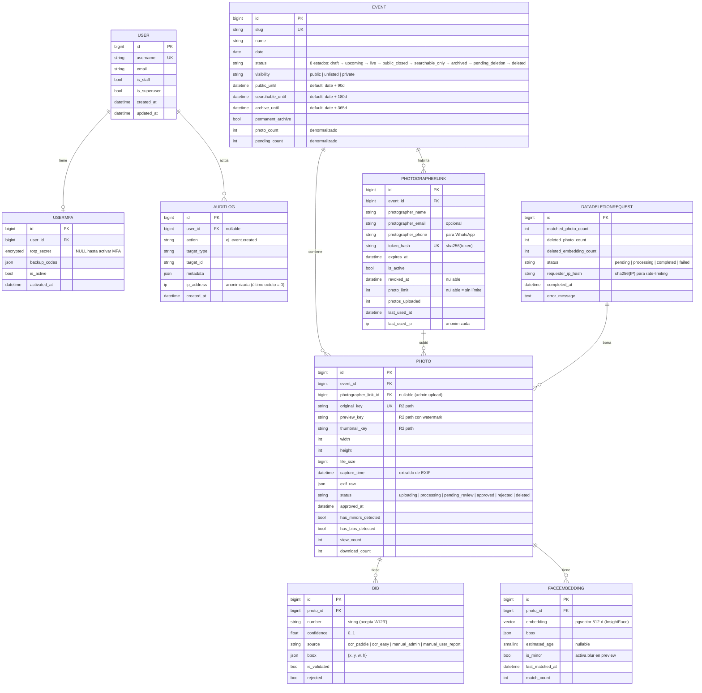

# Diagrama de entidades (ERD)

## Convenciones

- **TimeStampedModel**: todos los modelos del dominio heredan `created_at` (auto_now_add) y `updated_at` (auto_now). No los repito en el diagrama por brevedad excepto donde son significativos.
- **`UK`**: unique constraint.
- **`FK`**: foreign key (cardinalidad indicada con `||--o{`, etc.).
- **`anonimizada`**: campos de IP se zerifican antes de guardar (último octeto en IPv4, últimos 80 bits en IPv6) — privacidad por defecto.
- **`encrypted`**: campo que pasa por `apps.core.fields.EncryptedCharField` (Fernet + clave derivada de `SECRET_KEY`).

## Decisiones de diseño relevantes

- **`User` custom desde día 1**: heredamos de `AbstractUser` (`apps.core.User`) y registramos `AUTH_USER_MODEL = "core.User"`. Migrar después es costoso.
- **`AuditLog` append-only**: el admin **no puede** editar ni borrar registros desde Django Admin. Sólo lectura.
- **`DataDeletionRequest` no guarda el embedding**: el selfie del solicitante se procesa en memoria; sólo persistimos el hash de la IP (para rate-limiting) y contadores.
- **`FaceEmbedding` con HNSW**: índice `vector_cosine_ops` con `m=16` y `ef_construction=64`. Si en el futuro pasamos de ~180k vectores, evaluamos subir `m` o ir a IVFFlat.
- **Retención escalonada** en `Event`: 4 ventanas temporales independientes (`public_until`, `searchable_until`, `archive_until`, y `permanent_archive` que las bypasea). Ver ADR 0003.
